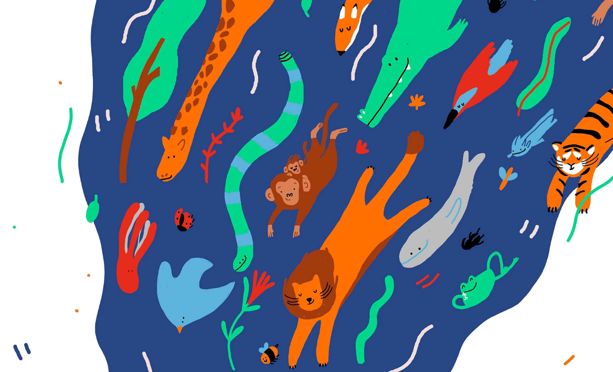

## ¡hola!👋 te doy la bienvenida a mi portfolio
En este repo encontraras una maquetación con html y css y nada de Js

Este proyecto parte de un diseño que realice hace unos años cuando era alumna de programación.
https://www.figma.com/design/Fh29kNSCHSpbLuMhvWxqfF/Portfolio?node-id=0-1&p=f

Estos colores y estilos están sacados de una ilustración que dibuje en 2019 

